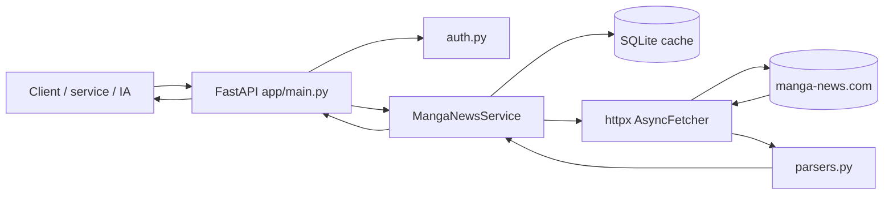

# Manga News Private API

API non officielle, auto-hébergée, qui récupère les pages publiques de Manga News et les expose sous forme de JSON propre, stable et réutilisable.

Elle est pensée pour trois cas d'usage :
- un projet perso qui a besoin de métadonnées manga ;
- un autre service qui veut consommer des fiches série / volume sans parser du HTML ;
- une IA ou un agent qui doit résoudre un titre puis interroger l'API de manière fiable.

## Ce que l'API sait faire

- rechercher une série ou un volume ;
- résoudre automatiquement le meilleur résultat ;
- récupérer une fiche série ;
- récupérer une fiche volume ;
- lister les contenus liés à une série ;
- lister les éditions VF / VO d'une série ;
- lire les news globales ;
- lire les news d'une série ou d'un volume ;
- interroger le planning des sorties.

## Ce que l'API **ne** fait pas

- elle n'utilise pas d'API officielle Manga News ;
- elle ne garantit pas que le HTML source ne changera jamais ;
- elle ne fournit pas aujourd'hui de routes `/v1` ;
- elle ne remplace pas un vrai moteur de suivi ou d'alerting.

## Démarrage rapide

### Local Python

```bash
python -m venv .venv
source .venv/bin/activate  # Linux/macOS
# .venv\Scripts\activate   # Windows PowerShell
pip install -r requirements.txt
cp .env.example .env
uvicorn app.main:app --reload --host 0.0.0.0 --port 8017
```

Ensuite :
- Swagger UI : `http://localhost:8017/docs`
- OpenAPI brut : `http://localhost:8017/openapi.json`
- health : `http://localhost:8017/health`

### Docker Compose

```bash
cp .env.example .env
docker compose up -d --build
```

Port exposé par défaut : `8017`.
Le conteneur écoute en interne sur `8000`.

## Authentification

Si `API_TOKEN` est vide, l'API est ouverte sur le réseau où elle est exposée.

Si `API_TOKEN` est défini, chaque requête doit envoyer :

```http
Authorization: Bearer <token>
```

Exemple :

```bash
curl -H "Authorization: Bearer MON_TOKEN" "http://localhost:8017/health"
```

## Contrat HTTP à connaître

### Enveloppe de réponse

Presque toutes les routes renvoient une enveloppe standard :

```json
{
  "schema_version": "1.0",
  "ok": true,
  "found": true,
  "source": "manga_news",
  "source_url": "https://www.manga-news.com/...",
  "cached": false,
  "fetched_at": "2026-04-20T12:00:00+00:00",
  "cache_expires_at": "2026-04-21T12:00:00+00:00",
  "partial": false,
  "warnings": [],
  "fingerprint": "...",
  "data": {}
}
```

### Cache côté client : `ETag`

Quand une réponse contient un `fingerprint`, l'API renvoie aussi :
- `ETag: "<fingerprint>"`
- `X-Data-Fingerprint: <fingerprint>`

Tu peux donc renvoyer :

```http
If-None-Match: "<fingerprint>"
```

et obtenir `304 Not Modified` si rien n'a changé.

### Erreurs

Actuellement, le format d'erreur est simple :

```json
{ "detail": "..." }
```

Codes principaux :
- `401` : token manquant ou invalide ;
- `404` : ressource absente côté Manga News ;
- `502` : erreur d'accès à Manga News ou parsing cassé ;
- `304` : inchangé quand `If-None-Match` est fourni.

## Premiers appels utiles

### 1) Résoudre une série

```bash
curl --get "http://localhost:8017/search/resolve" \
  --data-urlencode "q=one piece" \
  --data-urlencode "kind=series"
```

### 2) Charger la fiche série

```bash
curl "http://localhost:8017/series/One-piece-Edition-originale"
```

### 3) Charger uniquement quelques champs

```bash
curl --get "http://localhost:8017/series/One-piece-Edition-originale" \
  --data-urlencode "fields=title,vf.volumes,next_release_date"
```

### 4) Charger les éditions VF / VO

```bash
curl "http://localhost:8017/series/One-piece-Edition-originale/editions?edition=all"
```

### 5) Charger un volume

```bash
curl "http://localhost:8017/volume/One-Piece/vol-110"
```

### 6) Lire le planning

```bash
curl --get "http://localhost:8017/planning" \
  --data-urlencode "section=manga-vf" \
  --data-urlencode "year=2026" \
  --data-urlencode "month=4" \
  --data-urlencode "publisher=Glénat" \
  --data-urlencode "sort=date_asc"
```

## Architecture



Explication rapide :
- **FastAPI** expose le contrat HTTP et l'OpenAPI ;
- **MangaNewsService** orchestre cache, fetch et parsing ;
- **AsyncFetcher** récupère les pages HTML / RSS ;
- **parsers.py** convertit le HTML en structures Python ;
- **SQLiteCache** stocke les réponses pour éviter de refrapper inutilement l'upstream.

Le schéma détaillé est dans [`docs/ARCHITECTURE.md`](docs/ARCHITECTURE.md).

## Documentation à lire selon ton besoin

- [`docs/API_INTEGRATION.md`](docs/API_INTEGRATION.md) : guide d'intégration complet, endpoint par endpoint ;
- [`docs/USE_CASES_AND_RECIPES.md`](docs/USE_CASES_AND_RECIPES.md) : recettes concrètes, workflows et anti-patterns ;
- [`docs/OPENAPI_AND_AI_USAGE.md`](docs/OPENAPI_AND_AI_USAGE.md) : comment exploiter `/openapi.json`, Swagger et une IA ;
- [`docs/ARCHITECTURE.md`](docs/ARCHITECTURE.md) : composants, flux et rôle de chaque module ;
- [`docs/ONE_PIECE_API_TESTS.txt`](docs/ONE_PIECE_API_TESTS.txt) : scénario de test prêt à lancer.

## Variables d'environnement principales

- `APP_NAME` : nom affiché de l'application ;
- `APP_ENV` : environnement (`development`, `production`, etc.) ;
- `LOG_LEVEL` : niveau de logs ;
- `LOG_FORMAT` : `text` aujourd'hui ;
- `MANGA_NEWS_BASE_URL` : URL de base Manga News ;
- `USER_AGENT` : user-agent envoyé à Manga News ;
- `API_TOKEN` : token Bearer optionnel ;
- `DB_PATH` : chemin du cache SQLite ;
- `REQUEST_TIMEOUT_SECONDS` : timeout HTTP amont ;
- `CACHE_STALE_GRACE_SECONDS` : durée d'utilisation d'un cache périmé en cas d'erreur amont ;
- `CACHE_TTL_SEARCH_SECONDS` : TTL du cache recherche ;
- `CACHE_TTL_SERIES_SECONDS` : TTL des fiches série et éditions ;
- `CACHE_TTL_VOLUME_SECONDS` : TTL des fiches volume ;
- `CACHE_TTL_NEWS_GLOBAL_SECONDS` : TTL des news globales ;
- `CACHE_TTL_NEWS_SERIES_SECONDS` : TTL des news série / volume ;
- `CACHE_TTL_PLANNING_SECONDS` : TTL du planning ;
- `SEARCH_SCORE_THRESHOLD` : seuil minimal de score pour conserver un résultat ;
- `DEFAULT_LIMIT` : limite par défaut ;
- `MAX_LIMIT` : limite maximale ;
- `ENABLE_DOCS` : active `/docs` et `/redoc`.

## Limites connues

- cette API dépend du HTML public de Manga News ;
- si le site change fortement, certains parseurs devront être adaptés ;
- le cache réduit les appels mais ne remplace pas une vraie supervision ;
- la précision de `search/resolve` dépend de la qualité des résultats publics Manga News.

## Pour une autre IA : instruction minimale

1. Lis `/openapi.json` pour connaître le contrat réel.
2. Pour trouver une série ou un tome, commence par `/search/resolve`.
3. Utilise ensuite `/series/{slug}` ou `/volume/{series_slug}/{volume_slug}`.
4. Réutilise `ETag` avec `If-None-Match` quand tu relances la même requête.
5. Si tu veux limiter la taille des réponses, utilise `blocks` et `fields`.
6. Ne suppose pas l'existence d'autres routes que celles présentes dans l'OpenAPI.
