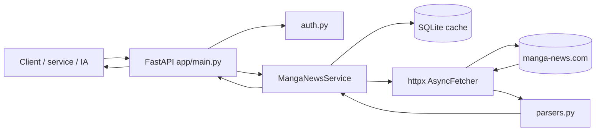

# Manga News Private API

API non officielle, auto-hébergée, qui récupère les pages publiques de Manga News et les expose sous forme de JSON propre, stable et réutilisable.

Elle sert surtout à trois cas d'usage :
- un projet perso qui a besoin de métadonnées manga ;
- un autre service qui veut consommer des fiches série / volume sans parser du HTML ;
- une IA ou un agent qui doit résoudre un titre puis interroger l'API de manière fiable.

## Ce que l'API sait faire aujourd'hui

Routes publiques réellement exposées :
- `GET /health`
- `GET /search`
- `GET /search/resolve`
- `GET /series/{slug}`
- `GET /series/by-url`
- `GET /series/{slug}/related`
- `GET /series/by-url/related`
- `GET /series/{slug}/editions`
- `GET /series/by-url/editions`
- `GET /volume/{series_slug}/{volume_slug}`
- `GET /volume/by-url`
- `GET /news/global`
- `GET /news/series/{slug}`
- `GET /news/volume/{series_slug}/{volume_slug}`
- `GET /news/volume/by-url`
- `GET /planning`

Capacités concrètes :
- recherche libre de séries et de volumes ;
- résolution automatique du meilleur résultat ;
- récupération de fiches série et volume ;
- projection partielle avec `blocks` et `fields` ;
- récupération des contenus liés et des éditions d'une série ;
- lecture des news globales, série et volume ;
- interrogation du planning de sorties ;
- cache côté client via `ETag` / `If-None-Match`.

## Ce que l'API ne fait pas aujourd'hui

- elle n'utilise pas d'API officielle Manga News ;
- elle ne garantit pas que le HTML source ne changera jamais ;
- elle ne fournit **pas** de namespace `/v1` ;
- elle n'expose **pas** aujourd'hui de routes admin publiques ;
- elle ne remplace pas un vrai moteur de suivi ou d'alerting.

## Démarrage rapide

### Local Python

```bash
python -m venv .venv
source .venv/bin/activate  # Linux/macOS
# .venv\Scripts\activate   # Windows PowerShell
pip install -r requirements.txt
cp .env.example .env
uvicorn app.main:app --reload --host 0.0.0.0 --port 8017
```

Ensuite :
- Swagger UI : `http://localhost:8017/docs`
- OpenAPI brut : `http://localhost:8017/openapi.json`
- health : `http://localhost:8017/health`

### Docker Compose

```bash
cp .env.example .env
docker compose up -d --build
```

Port exposé par défaut : `8017`.
Le conteneur écoute en interne sur `8000`.

## Authentification

Si `API_TOKEN` est vide, l'API est ouverte sur le réseau où elle est exposée.

Si `API_TOKEN` est défini, chaque requête doit envoyer :

```http
Authorization: Bearer <token>
```

Exemple :

```bash
curl -H "Authorization: Bearer MON_TOKEN" "http://localhost:8017/health"
```

## Contrat HTTP à connaître

### Enveloppe de réponse

Presque toutes les routes renvoient une enveloppe standard :

```json
{
  "schema_version": "1.0",
  "ok": true,
  "found": true,
  "source": "manga_news",
  "source_url": "https://www.manga-news.com/...",
  "cached": false,
  "fetched_at": "2026-04-20T12:00:00+00:00",
  "cache_expires_at": "2026-04-21T12:00:00+00:00",
  "partial": false,
  "warnings": [],
  "fingerprint": "...",
  "pagination": null,
  "data": {}
}
```

### Cache côté client : `ETag`

Quand une réponse contient un `fingerprint`, l'API renvoie aussi :
- `ETag: "<fingerprint>"`
- `X-Data-Fingerprint: <fingerprint>`

Tu peux donc renvoyer :

```http
If-None-Match: "<fingerprint>"
```

et obtenir `304 Not Modified` si rien n'a changé.

### Erreurs

Le format d'erreur public actuel est volontairement simple :

```json
{ "detail": "..." }
```

Codes principaux :
- `401` : token manquant ou invalide ;
- `404` : ressource absente côté Manga News ;
- `502` : erreur d'accès à Manga News ou parsing cassé ;
- `304` : inchangé quand `If-None-Match` est fourni.

## Premiers appels utiles

### 1) Résoudre une série

```bash
curl --get "http://localhost:8017/search/resolve"   --data-urlencode "q=one piece"   --data-urlencode "kind=series"
```

### 2) Charger la fiche série

```bash
curl "http://localhost:8017/series/One-piece-Edition-originale"
```

### 3) Charger uniquement quelques champs

```bash
curl --get "http://localhost:8017/series/One-piece-Edition-originale"   --data-urlencode "fields=title,vf.volumes,next_release_date"
```

### 4) Charger les éditions VF / VO

```bash
curl "http://localhost:8017/series/One-piece-Edition-originale/editions?edition=all"
```

### 5) Charger un volume

```bash
curl "http://localhost:8017/volume/One-Piece/vol-110"
```

### 6) Lire le planning

```bash
curl --get "http://localhost:8017/planning"   --data-urlencode "section=manga-vf"   --data-urlencode "year=2026"   --data-urlencode "month=4"   --data-urlencode "publisher=Glénat"   --data-urlencode "sort=date_asc"
```

## Architecture



Explication rapide :
- **FastAPI** expose le contrat HTTP et l'OpenAPI ;
- **MangaNewsService** orchestre cache, fetch et parsing ;
- **AsyncFetcher** récupère les pages HTML / RSS ;
- **parsers.py** convertit le HTML en structures Python ;
- **SQLiteCache** stocke les réponses pour éviter de refrapper inutilement l'upstream.

Le schéma détaillé est dans [`docs/ARCHITECTURE.md`](docs/ARCHITECTURE.md).

## Documentation à lire selon ton besoin

- [`docs/API_INTEGRATION.md`](docs/API_INTEGRATION.md) : guide d'intégration complet, endpoint par endpoint ;
- [`docs/USE_CASES_AND_RECIPES.md`](docs/USE_CASES_AND_RECIPES.md) : recettes concrètes, workflows et anti-patterns ;
- [`docs/OPENAPI_AND_AI_USAGE.md`](docs/OPENAPI_AND_AI_USAGE.md) : comment exploiter `/openapi.json`, Swagger et une IA ;
- [`docs/DEPLOYMENT_AND_OPERATIONS.md`](docs/DEPLOYMENT_AND_OPERATIONS.md) : configuration, Docker, cache, retries, diagnostic ;
- [`docs/ARCHITECTURE.md`](docs/ARCHITECTURE.md) : composants, flux et rôle de chaque module ;
- [`docs/ONE_PIECE_API_TESTS.txt`](docs/ONE_PIECE_API_TESTS.txt) : scénario de test prêt à lancer ;
- [`docs/API_CHANGELOG.md`](docs/API_CHANGELOG.md) : changelog du contrat HTTP et des payloads ;
- [`docs/examples/README.md`](docs/examples/README.md) : exemples JSON figés, utilisables par un dev ou une IA.

## Validation locale du contrat et de la doc

Commande recommandée après une modification :

```bash
python scripts/validate_contract_and_docs.py
pytest
```

La validation de contrat/doc vérifie notamment :
- que `/openapi.json` se génère ;
- que les routes attendues existent ;
- que les exemples JSON de `docs/examples/` sont valides ;
- que les liens Markdown locaux de la doc pointent sur de vrais fichiers.

## Variables d'environnement principales

Réglages utiles et réellement actifs aujourd'hui :
- `APP_NAME` : nom affiché de l'application ;
- `APP_ENV` : environnement (`development`, `production`, etc.) ;
- `LOG_LEVEL` : niveau de logs ;
- `LOG_FORMAT` : accepté par la config, mais les logs restent actuellement orientés texte ;
- `MANGA_NEWS_BASE_URL` : URL de base Manga News ;
- `USER_AGENT` : user-agent envoyé à Manga News ;
- `API_TOKEN` : token Bearer optionnel ;
- `DB_PATH` : chemin du cache SQLite ;
- `REQUEST_TIMEOUT_SECONDS` : timeout HTTP amont ;
- `REQUEST_MAX_RETRIES` : nombre de retries amont ;
- `REQUEST_BACKOFF_SECONDS` : base du backoff entre retries ;
- `CACHE_STALE_GRACE_SECONDS` : durée d'utilisation d'un cache périmé en cas d'erreur amont ;
- `CACHE_TTL_SEARCH_SECONDS` : TTL du cache recherche ;
- `CACHE_TTL_SERIES_SECONDS` : TTL des fiches série et éditions ;
- `CACHE_TTL_VOLUME_SECONDS` : TTL des fiches volume ;
- `CACHE_TTL_NEWS_GLOBAL_SECONDS` : TTL des news globales ;
- `CACHE_TTL_NEWS_SERIES_SECONDS` : TTL des news série / volume ;
- `CACHE_TTL_PLANNING_SECONDS` : TTL du planning ;
- `SEARCH_SCORE_THRESHOLD` : seuil minimal de score de recherche ;
- `DEFAULT_LIMIT` / `MAX_LIMIT` : limites par défaut et maximale côté API ;
- `ENABLE_DOCS` : expose ou non `/docs` et `/redoc`.

Variables présentes dans la configuration mais **pas exploitées par une route publique aujourd'hui** :
- `ADMIN_TOKEN`
- `ENABLE_LEGACY_ROUTES`
- `DEBUG_CAPTURE_HTML_ON_ERROR`
- `DEBUG_HTML_DUMP_DIR`
- `NEGATIVE_CACHE_ENABLED`
- `NEGATIVE_CACHE_TTL_SECONDS`
- `RATE_LIMIT_*`

Pour le comportement réel, la source de vérité reste toujours :
- le code ;
- `/openapi.json` ;
- les exemples figés de `docs/examples/`.
