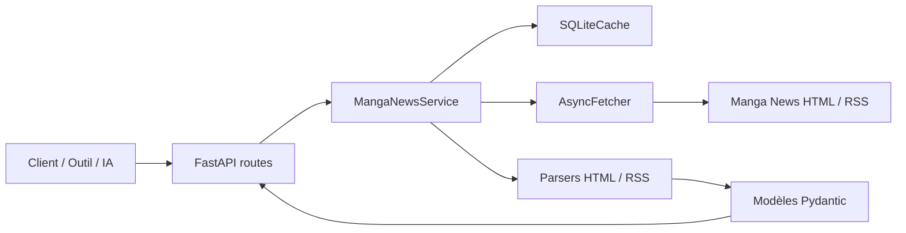
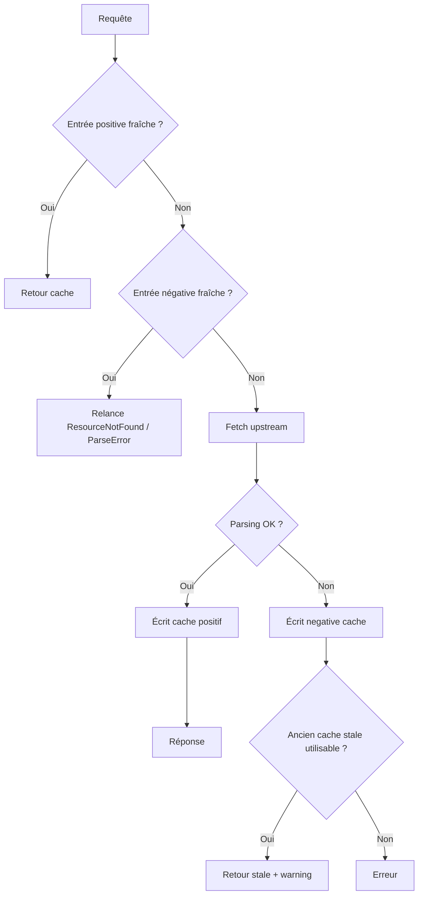

# Architecture

Ce document explique comment les composants s'enchaînent réellement.

## Vue d'ensemble



## Chaîne de traitement d'une requête

1. **Route FastAPI**
   - valide les paramètres ;
   - vérifie le Bearer token si `API_TOKEN` est actif ;
   - délègue au `MangaNewsService`.

2. **Service métier**
   - calcule une clé de cache stable ;
   - consulte le cache positif ;
   - consulte le negative cache si activé ;
   - fetch l'upstream si nécessaire ;
   - parse la réponse ;
   - construit l'enveloppe finale.

3. **Cache SQLite**
   - stocke les réponses positives ;
   - stocke aussi le HTML brut des pages série / volume pour éviter de retélécharger la même page quand plusieurs parseurs internes en ont besoin ;
   - stocke aussi les erreurs négatives courtes (`negative_cache_entries`) ;
   - garde une fenêtre stale pour servir une ancienne réponse si l'upstream échoue.

4. **Fetcher HTTP**
   - envoie les requêtes vers Manga News ;
   - suit les redirections ;
   - traduit les erreurs HTTP / réseau en erreurs applicatives.

5. **Parsers**
   - analysent le HTML / RSS ;
   - extraient les champs normalisés ;
   - lèvent `ParseError` quand la page n'est pas exploitable.

## Flux de cache



## Search vs search/resolve

### `/search`
- interroge plusieurs pages de recherche Manga News selon `kind` ;
- déduplique les URLs ;
- trie par score ;
- hydrate par défaut les compteurs `vf` / `vo` via un cache léger `series-search-meta` branché sur le HTML brut de la fiche série parente quand elle est nécessaire ;
- peut ensuite enrichir davantage les résultats retenus, mais uniquement si `enrich=true` est demandé ;
- déduplique les lectures détaillées par `series_slug` / `volume_slug` avant de lancer l'enrichissement.

### `/search/resolve`
- s'appuie sur `/search` ;
- choisit un `best` ;
- calcule une confiance (`high`, `medium`, `low`, `none`).

## Projections série / volume

Le service supporte deux mécanismes :
- `blocks=` : blocs métier prédéfinis ;
- `fields=` : chemins précis ;
- `include_raw_sections=true` : sections brutes du HTML déjà nettoyées.

C'est utile pour :
- les UI légères ;
- les prompts d'IA ;
- limiter la taille des payloads ;
- éviter des post-traitements inutiles côté client.

## Particularités utiles

### Titres alternatifs
- `title_vo`
- `translated_title`

Ils sont disponibles sur les fiches détaillées et remontent aussi dans les recherches par défaut tant que `include_editions=true`. `enrich=true` n'est plus nécessaire pour les seuls compteurs.

### Normalisation volume
Les parseurs produisent des champs standardisés pour les volumes :
- `number`
- `number_int`
- `edition_label`
- `is_special`
- `is_one_shot`

Ces champs se retrouvent sur :
- les fiches volume ;
- les items d'éditions série ;
- les items du planning.

## Debug HTML

Quand `DEBUG_CAPTURE_HTML_ON_ERROR=true`, un `ParseError` sur une route cacheable peut sauver :
- un dump `.html` de la page upstream ;
- un fichier `.json` de métadonnées.

Le chemin est injecté dans le message d'erreur :

```text
Debug HTML saved to /tmp/manga-news-debug-html/...
```

## Ce qui existe dans le code mais n'est pas encore une vraie feature publique

Présent dans la config ou dans des modules, mais non exposé comme contrat public aujourd'hui :
- admin API publique ;
- rate limiting branché aux routes ;
- format de logs JSON activé depuis la config runtime ;
- retries/backoff pilotés par les variables `REQUEST_MAX_RETRIES` / `REQUEST_BACKOFF_SECONDS`.

Le documente comme tel est plus honnête que de faire semblant que tout est déjà actif.

## Enrichissement des recherches

Pour certains résultats `/search`, le service relit une fiche détaillée avant de répondre :
- résultat `series` -> relit la fiche série pour injecter `title_vo`, `translated_title`, `vf`, `vo` ;
- résultat `volume` -> relit la fiche volume pour injecter les champs normalisés du volume, puis réutilise une lecture série dédupliquée pour injecter `vf` / `vo`.
- toutes ces lectures sont bornées par sémaphore pour éviter un emballement de concurrence.

Ce comportement rend les réponses plus utiles, mais explique aussi pourquoi une recherche peut déclencher plusieurs fetchs amont lors d'un cache froid.


## Optimisations runtime ajoutées

- cache mémoire L1 au-dessus de SQLite ;
- SQLite en mode WAL avec connexion persistante et `busy_timeout` ;
- cache HTML brut des pages série / volume, réutilisable entre plusieurs parseurs ;
- cache léger `series-search-meta` pour les chemins qui ont seulement besoin des titres alternatifs et des compteurs `vf` / `vo` ;
- cache source dédié pour les candidats de recherche, réutilisé entre plusieurs variantes de `/search` et `/search/resolve` ;
- cache séparé des blocs d'éditions série `vf` / `vo`, ensuite recomposés pour `/series/{slug}/editions` ;
- mutualisation single-flight des fetchs concurrents vers une même clé de cache ;
- logs `search_source_perf`, `search_perf`, `volume_perf` et `series_editions_perf` pour rendre visibles les coûts de chaque opération.
