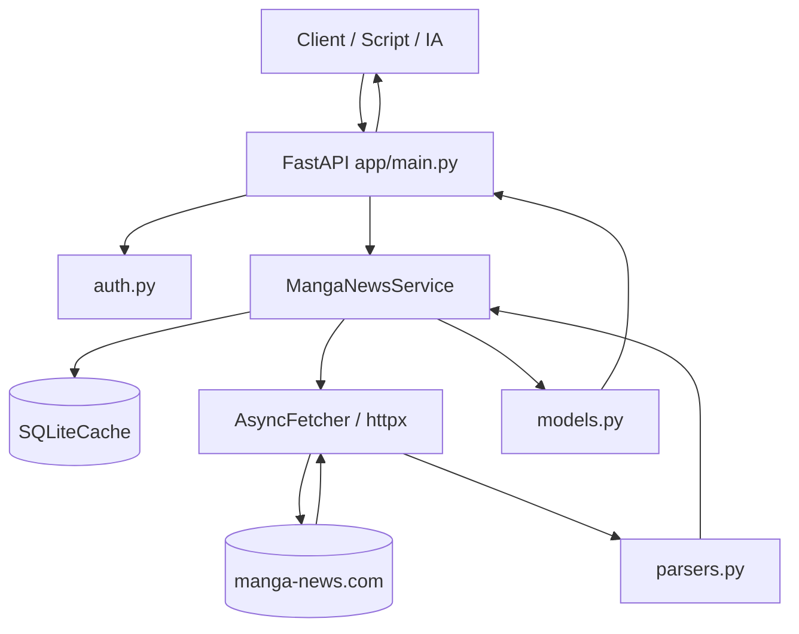
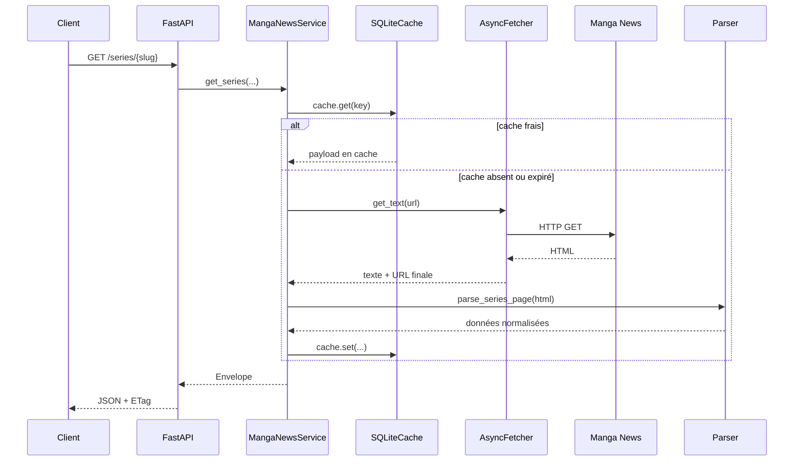

# Architecture de l'API

Ce document explique comment l'API est structurée, où se trouvent les responsabilités, et comment une requête traverse le système.

## 1. Schéma global

## 2. Rôle des modules

### `app/main.py`

Responsabilités :
- déclare les routes FastAPI ;
- initialise l'application ;
- branche l'auth, le service, le cache et le fetcher ;
- transforme les objets de réponse en JSON ;
- gère `ETag` / `If-None-Match` ;
- expose Swagger / ReDoc / OpenAPI.

### `app/config.py`

Responsabilités :
- charge les variables d'environnement ;
- fournit les réglages à l'application ;
- résout un chemin SQLite inscriptible.

### `app/auth.py`

Responsabilités :
- vérifie `Authorization: Bearer <token>` si `API_TOKEN` est défini.

### `app/http.py`

Responsabilités :
- exécute les appels HTTP vers Manga News ;
- applique le `User-Agent` et le timeout ;
- normalise les erreurs amont.

### `app/cache.py`

Responsabilités :
- stocke les réponses dans SQLite ;
- gère les dates d'expiration et la fenêtre de stale cache.

### `app/manga_news/service.py`

Responsabilités :
- orchestre fetch + cache + parse ;
- expose des méthodes métier (`search`, `get_series`, `get_volume`, etc.) ;
- gère la projection `blocks` / `fields` ;
- construit l'enveloppe de réponse.

### `app/manga_news/parsers.py`

Responsabilités :
- convertit le HTML public Manga News en structures normalisées ;
- isole la logique la plus fragile du projet.

### `app/models.py`

Responsabilités :
- déclare les modèles Pydantic ;
- pilote le schéma OpenAPI ;
- stabilise la forme JSON côté client.

## 3. Cycle d'une requête

### Cas simple : `GET /series/{slug}`

## 4. Points de fragilité réels

Les zones réellement fragiles sont :
- les sélecteurs / repères HTML utilisés par les parsers ;
- la qualité et la cohérence des pages Manga News ;
- les résultats de recherche publics ;
- le flux RSS et sa structure.

Les zones plutôt stables sont :
- l'enveloppe JSON de sortie ;
- les routes FastAPI ;
- l'usage du cache et des ETags.

## 5. Pourquoi cette séparation est saine

Cette architecture sépare clairement :
- le contrat HTTP (`main.py`) ;
- l'accès réseau (`http.py`) ;
- le stockage local (`cache.py`) ;
- la logique métier (`service.py`) ;
- la fragilité HTML (`parsers.py`).

Résultat :
- tu peux corriger un parseur sans casser tout le reste ;
- tu peux auditer facilement ce qui relève du contrat public ;
- tu peux brancher une autre source plus tard en gardant la même enveloppe JSON.

## 6. Ce qu'un nouveau développeur doit lire en premier

Ordre conseillé :
1. `README.md`
2. `docs/API_INTEGRATION.md`
3. `app/main.py`
4. `app/manga_news/service.py`
5. `app/manga_news/parsers.py`
6. les tests dans `tests/`
