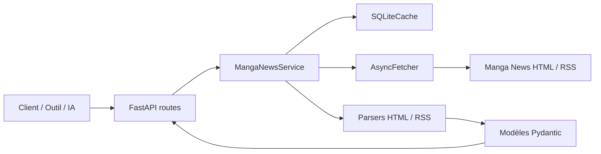
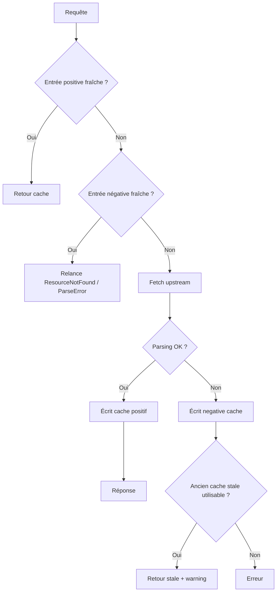

# Architecture

Ce document explique comment les composants s'enchaînent réellement.

## Vue d'ensemble



## Chaîne de traitement d'une requête

1. **Route FastAPI**
   - valide les paramètres ;
   - vérifie le Bearer token si `API_TOKEN` est actif ;
   - délègue au `MangaNewsService`.

2. **Service métier**
   - calcule une clé de cache stable ;
   - consulte le cache positif ;
   - consulte le negative cache si activé ;
   - mutualise les fetchs concurrents identiques via un mécanisme local de type single-flight ;
   - fetch l'upstream si nécessaire ;
   - parse la réponse ;
   - construit l'enveloppe finale.

3. **Cache SQLite**
   - stocke les réponses positives ;
   - stocke aussi les erreurs négatives courtes (`negative_cache_entries`) ;
   - garde une fenêtre stale pour servir une ancienne réponse si l'upstream échoue ;
   - réutilise une connexion SQLite persistante avec `journal_mode=WAL`, `synchronous=NORMAL` et `busy_timeout`.

4. **Fetcher HTTP**
   - envoie les requêtes vers Manga News ;
   - suit les redirections ;
   - traduit les erreurs HTTP / réseau en erreurs applicatives.

5. **Parsers**
   - analysent le HTML / RSS ;
   - extraient les champs normalisés ;
   - lèvent `ParseError` quand la page n'est pas exploitable.

## Flux de cache



## Search vs search/resolve

### `/search`
- interroge plusieurs pages de recherche Manga News selon `kind` ;
- cache d'abord les **pages source de recherche** par URL, indépendamment de `mode` et `limit` ;
- recharge ces pages source en parallèle, dans la limite de `SEARCH_SOURCE_CONCURRENCY` ;
- déduplique les URLs ;
- trie par score ;
- enrichit ensuite les résultats retenus en mutualisant les fiches série / volume identiques, dans la limite de `SEARCH_ENRICHMENT_CONCURRENCY`.

### `/search/resolve`
- s'appuie sur `/search` ;
- choisit un `best` ;
- calcule une confiance (`high`, `medium`, `low`, `none`).

## Projections série / volume

Le service supporte deux mécanismes :
- `blocks=` : blocs métier prédéfinis ;
- `fields=` : chemins précis ;
- `include_raw_sections=true` : sections brutes du HTML déjà nettoyées.

C'est utile pour :
- les UI légères ;
- les prompts d'IA ;
- limiter la taille des payloads ;
- éviter des post-traitements inutiles côté client.

## Particularités utiles

### Titres alternatifs
- `title_vo`
- `translated_title`

Ils sont disponibles sur les fiches détaillées et remontent aussi dans les recherches quand l'enrichissement réussit.

### Normalisation volume
Les parseurs produisent des champs standardisés pour les volumes :
- `number`
- `number_int`
- `edition_label`
- `is_special`
- `is_one_shot`

Ces champs se retrouvent sur :
- les fiches volume ;
- les items d'éditions série ;
- les items du planning.

## Debug HTML

Quand `DEBUG_CAPTURE_HTML_ON_ERROR=true`, un `ParseError` sur une route cacheable peut sauver :
- un dump `.html` de la page upstream ;
- un fichier `.json` de métadonnées.

Le chemin est injecté dans le message d'erreur :

```text
Debug HTML saved to /tmp/manga-news-debug-html/...
```

## Ce qui existe dans le code mais n'est pas encore une vraie feature publique

Présent dans la config ou dans des modules, mais non exposé comme contrat public aujourd'hui :
- admin API publique ;
- rate limiting branché aux routes.

Les variables suivantes sont maintenant **actives** dans le runtime :
- `LOG_FORMAT`
- `REQUEST_MAX_RETRIES`
- `REQUEST_BACKOFF_SECONDS`
- `SEARCH_SOURCE_CONCURRENCY`
- `SEARCH_ENRICHMENT_CONCURRENCY`

## Enrichissement des recherches

Pour certains résultats `/search`, le service relit une fiche détaillée avant de répondre :
- résultat `series` -> relit la fiche série pour injecter `title_vo`, `translated_title`, `vf`, `vo` ;
- résultat `volume` -> relit la fiche volume pour injecter les champs normalisés du volume, puis relit la fiche série parente pour injecter `vf` / `vo`.

Ce comportement rend les réponses plus utiles, mais explique aussi pourquoi une recherche peut déclencher plusieurs fetchs amont lors d'un cache froid.

## Réglages d'exécution réellement pilotables

Les knobs suivants sont à nouveau pilotés par l'environnement et appliqués par le runtime :

- `SQLITE_BUSY_TIMEOUT_MS` pour le `PRAGMA busy_timeout` SQLite ;
- `CACHE_MEMORY_ENTRIES` pour le cache mémoire L1 ;
- `SEARCH_DEFAULT_ENRICH` et `SEARCH_DEFAULT_INCLUDE_EDITIONS` pour les routes de recherche ;
- `VOLUME_DEFAULT_INCLUDE_PARENT_EDITIONS` pour l'hydratation des compteurs sur `/volume`. Par défaut, il vaut désormais `false` pour éviter un refetch série implicite sur les lectures volume standards.
