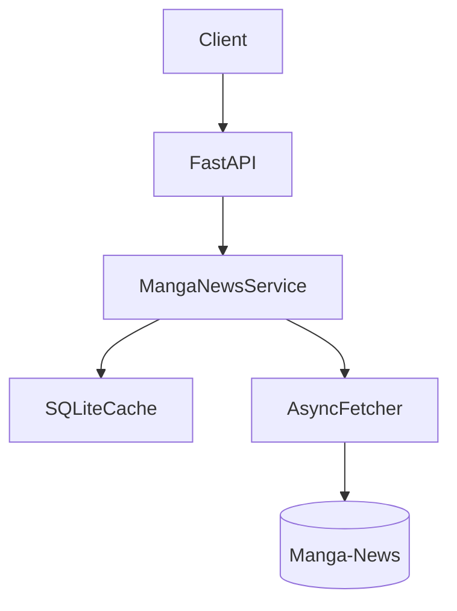
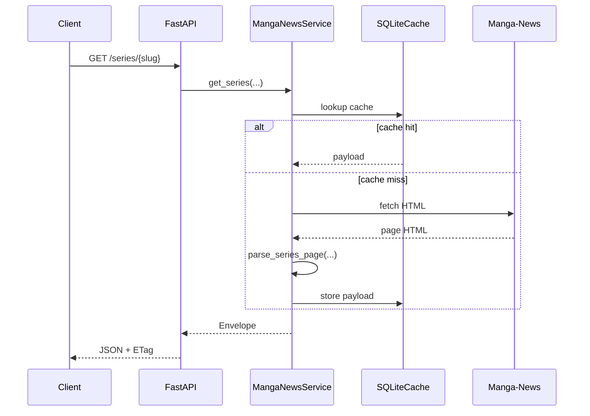

# Architecture

## Vue d'ensemble

## Composants principaux

### `app/main.py`
Expose les routes FastAPI, l'OpenAPI, Swagger UI et ReDoc.

### `app/manga_news/service.py`
Couche métier principale.
Responsabilités :
- construire les URLs Manga-News ;
- orchestrer fetch + cache + parsing ;
- enrichir les résultats de recherche ;
- projeter les payloads via `blocks` / `fields`.

### `app/manga_news/parsers.py`
Transforme le HTML Manga-News en modèles Pydantic.

### `app/cache.py`
Cache SQLite persistant avec TTL, stale grace et cache négatif.

### `app/http.py`
Client HTTP asynchrone, retries limités et instrumentation simple.

### `app/models.py`
Schémas Pydantic du contrat exposé.

## Flux de lecture d'une fiche série

## Flux de recherche enrichie

1. Le service appelle une ou plusieurs pages de recherche Manga-News.
2. `parse_search_page(...)` extrait les candidats bruts.
3. Chaque candidat reçoit un `score` fuzzy.
4. Les meilleurs candidats sont enrichis :
   - `title_vo`
   - `translated_title`
   - pour les séries : `vf` / `vo`
   - pour les volumes : titres alternatifs + `vf` / `vo` de la série parente si disponibles

C'est ce qui permet, par exemple, à un résultat volume `Dogs: Bullets & Carnage Vol.1` de renvoyer aussi :
- `title_vo`
- `translated_title`
- `vf: { volumes: 9, status: "En cours" }`
- `vo: { volumes: 10, status: "En pause" }`

## Projection des fiches

Les routes `/series/...` et `/volume/...` supportent deux mécanismes :
- `blocks` : projection logique par groupes de champs ;
- `fields` : projection fine par chemins précis.

Exemple :
- `blocks=editions,stats`
- `fields=title,vf.volumes`

## Cache négatif

Le cache négatif évite de refetcher immédiatement une ressource qui a déjà échoué récemment :
- `RESOURCE_NOT_FOUND`
- `UPSTREAM_FETCH_ERROR`
- `UPSTREAM_PARSE_ERROR`

## Dump HTML debug

Si `DEBUG_CAPTURE_HTML_ON_ERROR=true`, un `ParseError` sur une ressource cacheable peut provoquer l'écriture de :
- un dump `.html` ;
- un companion `.json` avec métadonnées de debug.

## Ce qui n'est pas exposé aujourd'hui

Pour éviter les ambiguïtés :
- pas de `/v1` ;
- pas de routes admin publiques ;
- pas de pagination top-level standard ;
- pas de lookup volume dédié.
