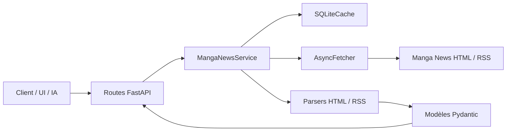
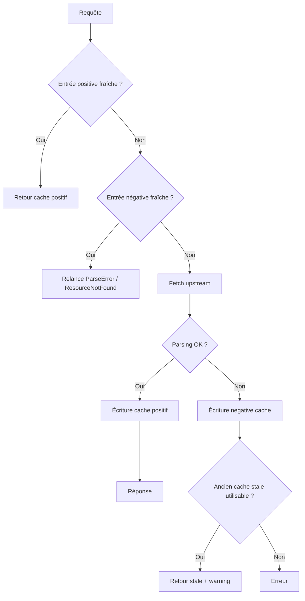

# Architecture

Ce document décrit le fonctionnement réel du projet actuel : requête entrante, service métier, cache, fetch upstream et parsing.

## Vue d'ensemble



## Chaîne de traitement d'une requête

1. **Route FastAPI**
   - valide les paramètres ;
   - applique l'authentification si `API_TOKEN` est configuré ;
   - délègue au `MangaNewsService`.

2. **Service métier**
   - construit une clé de cache stable ;
   - consulte le cache positif ;
   - consulte le negative cache si activé ;
   - fetch l'upstream si nécessaire ;
   - parse le HTML ou le flux RSS ;
   - construit l'enveloppe finale.

3. **SQLiteCache**
   - stocke les réponses positives ;
   - stocke des erreurs négatives courtes pour les ressources cassées ou absentes ;
   - conserve une fenêtre stale pour fallback si l'upstream casse ensuite.

4. **AsyncFetcher**
   - récupère le HTML ou le RSS ;
   - suit les redirections ;
   - lève `ResourceNotFound` pour les `404` ;
   - lève `UpstreamError` pour les autres erreurs réseau/HTTP ou réponses vides.

5. **Parsers**
   - transforment le HTML Manga News en structures Pydantic ;
   - exposent des champs normalisés pour les volumes ;
   - lèvent `ParseError` quand le contrat attendu n'est pas fiable.

## Flux de cache



## Search vs search/resolve

### `/search`
- interroge plusieurs pages de recherche Manga News selon `kind` ;
- déduplique les résultats par URL ;
- trie par `score` décroissant ;
- peut enrichir chaque résultat retenu avec `title_vo` et `translated_title` via la fiche détaillée.

### `/search/resolve`
- s'appuie sur `/search` ;
- sélectionne un `best` ;
- calcule `confidence`.

## Projections sur les fiches

Les routes détail `series` et `volume` supportent :
- `blocks=` pour des groupes de champs prédéfinis ;
- `fields=` pour des chemins précis ;
- `include_raw_sections=true` pour inclure les sections brutes parsées.

Ce mécanisme sert à :
- limiter la taille des payloads ;
- alimenter une UI compacte ;
- piloter une IA sans surcharger le contexte ;
- éviter des post-traitements côté client.

## Normalisation métier déjà intégrée

### Titres alternatifs
- `title_vo`
- `translated_title`

Ils sont disponibles sur les fiches détaillées. Les résultats de recherche peuvent aussi les exposer après enrichissement.

### Volumes
Les parseurs normalisent déjà plusieurs champs :
- `number`
- `number_int`
- `edition_label`
- `is_special`
- `is_one_shot`

Ces champs remontent sur :
- les fiches volume ;
- les items d'éditions série ;
- les items du planning quand ils sont inférables.

## Debug HTML sur parse error

Quand `DEBUG_CAPTURE_HTML_ON_ERROR=true`, une `ParseError` sur une route cacheable peut écrire :
- un dump `.html` du contenu upstream ;
- un fichier `.json` de métadonnées.

Le chemin peut être injecté dans le message d'erreur :

```text
Debug HTML saved to /tmp/manga-news-debug-html/...
```

## Ce qui existe dans le code sans être un contrat public actif

Le projet contient encore quelques briques ou variables de config qui ne sont pas exposées aujourd'hui comme API publique :
- `ADMIN_TOKEN` ;
- `RATE_LIMIT_*` ;
- routes admin ;
- préfixe de version `/v1` ;
- endpoint `lookup/volume`.

La documentation doit rester honnête là-dessus.
