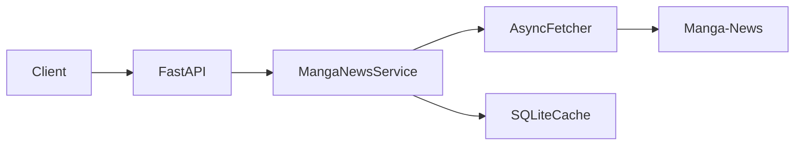
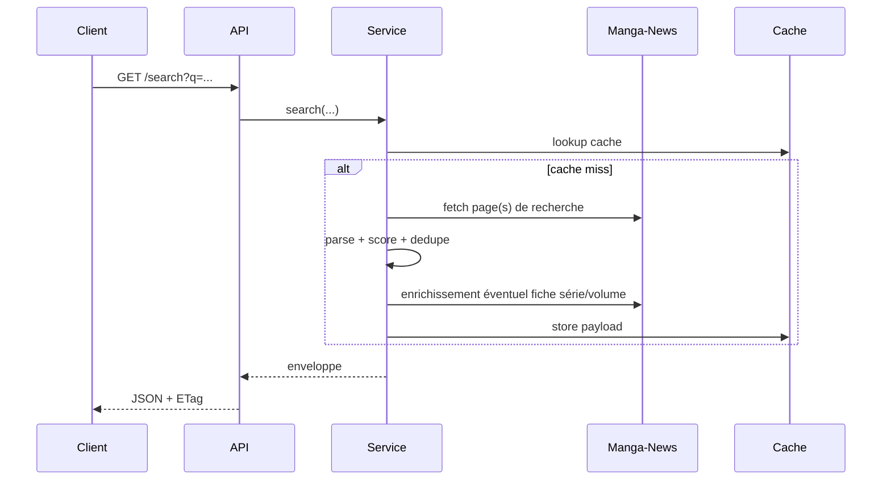

# Architecture

## Vue d'ensemble

## Rôles

- `app/main.py` : exposition HTTP et OpenAPI ;
- `app/manga_news/service.py` : orchestration, cache, enrichissement, projections ;
- `app/manga_news/parsers.py` : lecture HTML et normalisation ;
- `app/cache.py` : cache SQLite principal + cache négatif ;
- `app/utils.py` : normalisation de texte, matching, dates, slugs.

## Flux de recherche

## D'où viennent les compteurs VF / VO

- source HTML : bloc `#numberblock` sur la fiche série Manga-News ;
- consommation directe : `/series/{slug}` ;
- consommation indirecte : `/volume/{series_slug}/{volume_slug}` et résultats de recherche enrichis.

Cela explique pourquoi :
- un volume peut avoir `vf` / `vo` même si sa page propre ne contient pas ces compteurs ;
- un résultat de recherche volume peut avoir `vf` / `vo` après enrichissement de la série parente.
